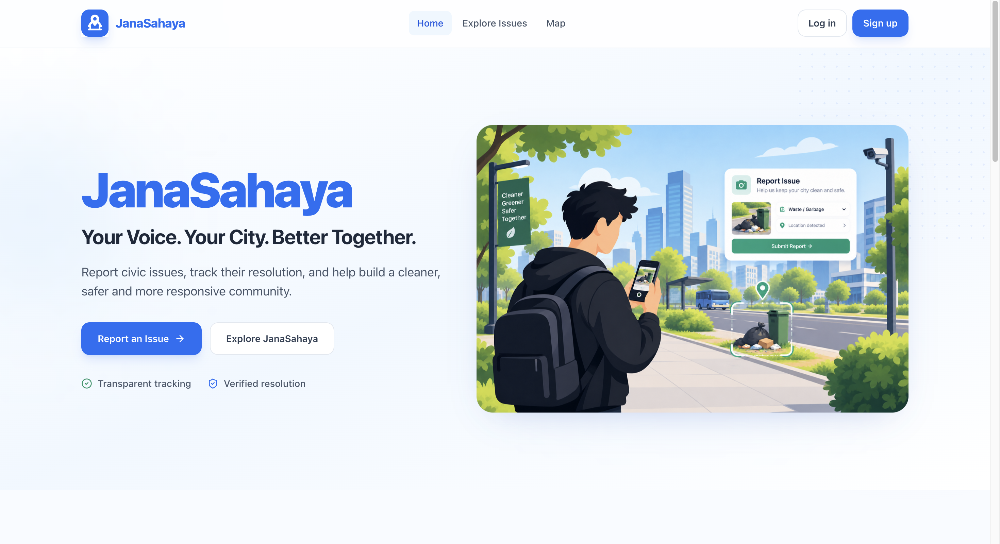
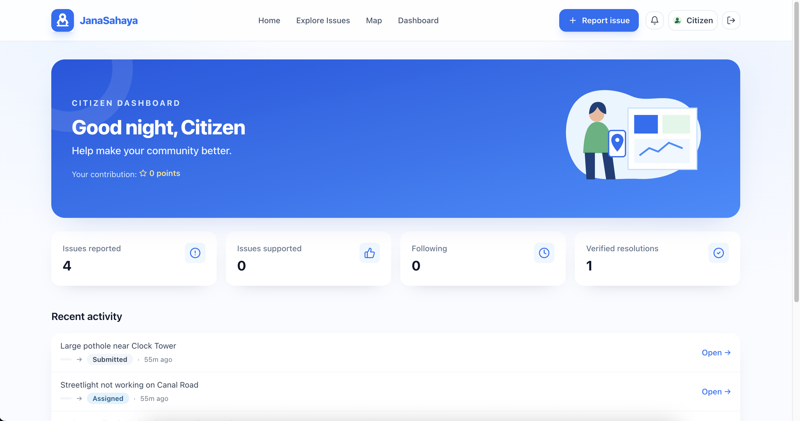
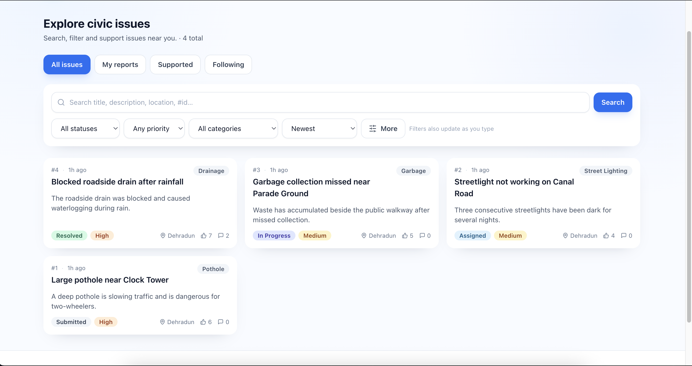
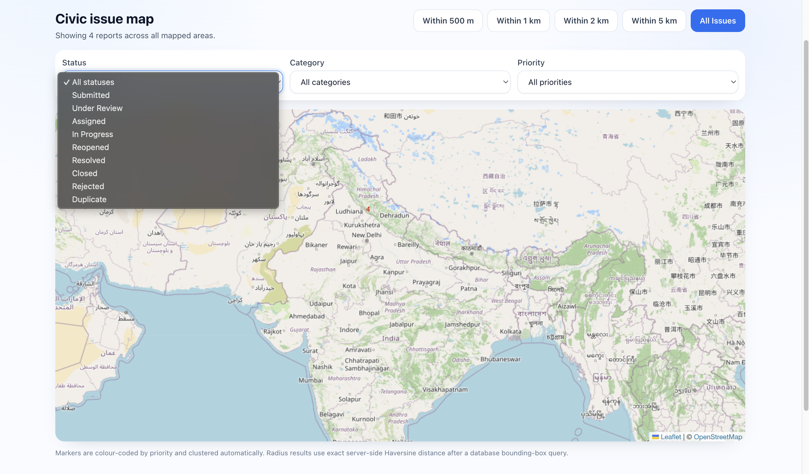
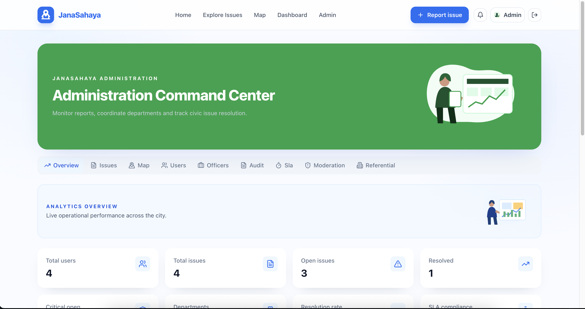
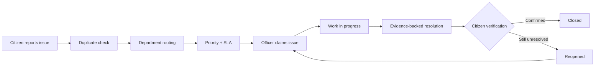
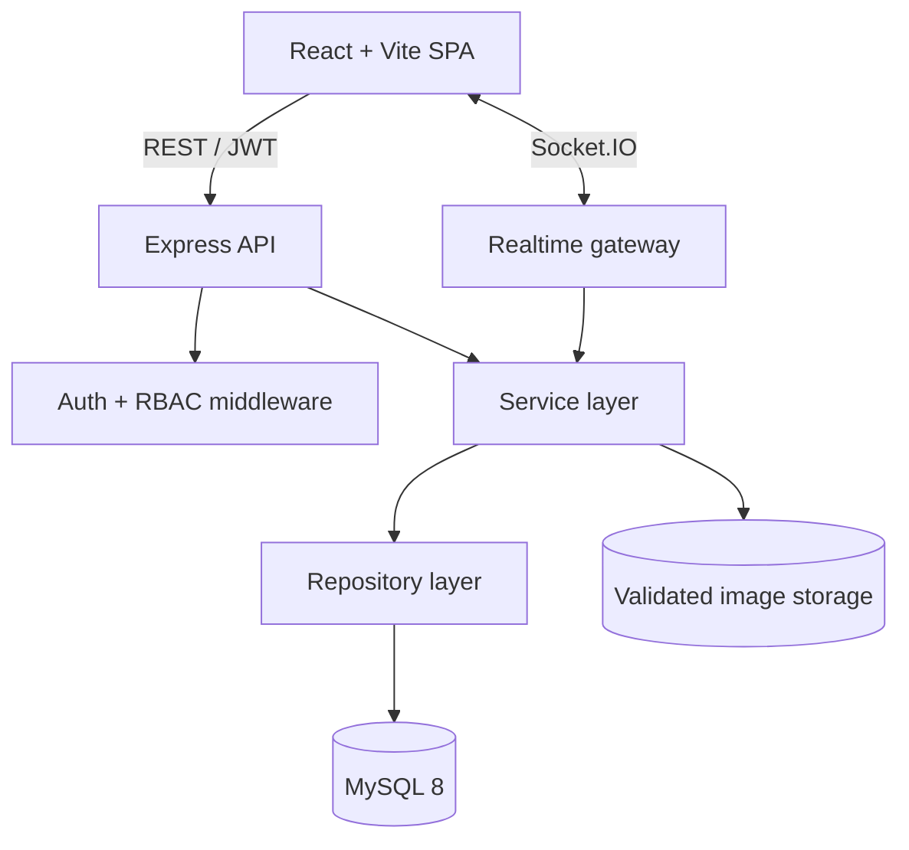

<div align="center">

# Jana-Sahaya

### A transparent, real-time civic issue reporting and resolution platform

JanaSahaya connects citizens, municipal officers, and administrators in one accountable workflow—from a geotagged report to evidence-backed resolution and citizen verification.

[](https://react.dev/)
[](https://nodejs.org/)
[](https://expressjs.com/)
[](https://www.mysql.com/)
[](https://socket.io/)
[](backend/docs/openapi.yaml)
[](#testing)

**[Live application](https://jana-sahaya.vercel.app)** · **[API documentation](https://janasahaya-production.up.railway.app/api/docs)** · **[API status](https://janasahaya-production.up.railway.app/ready)**

</div>

<p align="center">
  <a href="https://jana-sahaya.vercel.app">
    
  </a>
</p>

## Why JanaSahaya stands out

This is more than a CRUD ticketing app. It models the difficult parts of a real public-service workflow: concurrent ownership, explainable prioritization, duplicate reports, role boundaries, resolution evidence, citizen feedback, and auditability.

| Engineering challenge | Implementation |
| --- | --- |
| Duplicate reports | Haversine distance, category match, text similarity, and recency combine into an explainable score; likely duplicates are surfaced before submission. |
| Fair prioritization | A 0–100 score weighs category severity, citizen votes, issue age, merged duplicates, nearby issue density, and escalations—and exposes the reasons behind the score. |
| Concurrent officer claims | Conditional updates inside MySQL transactions ensure two officers cannot claim the same issue. Conflicts return `409`. |
| Trustworthy resolution | Officers must attach evidence; citizen verification is row-locked and can safely reopen an unresolved issue without duplicate transitions. |
| Secure sessions | Short-lived JWT access tokens pair with rotating, hashed refresh tokens in `httpOnly` cookies; reuse revokes the entire token family. |
| Live collaboration | Socket.IO rooms push issue status, map, and notification updates to the relevant users in real time. |
| Operational accountability | Validated state transitions, SLA deadlines, escalations, moderation signals, and admin audit logs preserve a traceable history. |

## Product tour

<table>
  <tr>
    <td width="50%" align="center">
      
      <br /><strong>Citizen Dashboard</strong>
    </td>
    <td width="50%" align="center">
      
      <br /><strong>Geotagged Reporting</strong>
    </td>
  </tr>
  <tr>
    <td width="50%" align="center">
      
      <br /><strong>Interactive Issue Map</strong>
    </td>
    <td width="50%" align="center">
      
      <br /><strong>Operations Dashboard</strong>
    </td>
  </tr>
</table>

## End-to-end workflow



The backend enforces every transition and the role allowed to perform it. Officers are restricted to their department; administrators can triage and reassign; citizens cannot bypass the lifecycle.

### Role-based capabilities

| Citizen | Municipal officer | Administrator |
| --- | --- | --- |
| Report with GPS, map pin, address, and photos | View a department-scoped queue | Triage, assign, and override status |
| Review duplicate suggestions | Atomically claim available work | Manage users, roles, departments, and categories |
| Vote, follow, comment, and reply | Update progress and submit resolution evidence | Configure SLA rules and acknowledge escalations |
| Track status and receive live notifications | Monitor priority reasons and SLA health | Review moderation signals, analytics, and audit logs |
| Verify a resolution or trigger reopening | Continue only work assigned to the officer | Protect the last remaining administrator account |

## System design



The codebase separates HTTP controllers, business services, and SQL repositories. The schema contains 22 relational tables for identities, roles, issues, assignments, status history, resolutions, interactions, SLA data, notifications, reports, and audit records.

### Technology choices

| Area | Stack |
| --- | --- |
| Client | React 18, Vite 5, Tailwind CSS, React Router |
| Maps and analytics | Leaflet, React Leaflet, Recharts |
| API | Node.js 22, Express 4, OpenAPI 3.0 |
| Data and realtime | MySQL 8, Socket.IO 4 |
| Security | JWT, bcrypt, Helmet, CORS, rate limiting, upload signature checks |
| Delivery | Docker, Docker Compose, Nginx, Vercel, Railway |
| Quality | Node test runner, Vitest, Testing Library, smoke and load suites |

## Security and reliability

- Role-based access control with department-level authorization for officers.
- Refresh-token rotation, SHA-256 token storage, family-based reuse detection, and session revocation.
- Transactional issue creation, claiming, resolution, assignment, and citizen verification.
- Strict lifecycle validation prevents invalid or out-of-order status changes.
- Rate limits cover authentication, registration, password changes, reports, comments, and interactions.
- Image uploads use MIME and extension allow-lists, blocked dangerous extensions, random filenames, size/count limits, and magic-byte verification.
- Helmet headers, restrictive CORS, sensitive log redaction, parameterized SQL, and centralized error handling.
- Separate `/health` and database-aware `/ready` probes support deployment monitoring.

## Run locally

### Docker Compose

Prerequisites: Docker with Compose.

```bash
git clone https://github.com/alive7z/JanaSahaya.git
cd JanaSahaya
cp .env.example .env
# Replace every CHANGE_ME value, then:
docker compose up -d --build
```

The frontend is available at `http://localhost:8080`. MySQL and the API remain isolated inside the Compose network, and named volumes preserve database data and uploaded evidence.

### Development mode

Prerequisites: Node.js 22+ and MySQL 8+.

```bash
# Terminal 1 — API
cd backend
cp .env.example .env
npm ci
npm run db:setup
npm run dev                    # http://localhost:4000

# Terminal 2 — client
cd frontend
cp .env.example .env
npm ci
npm run dev                    # http://localhost:5173
```

The Vite development server proxies `/api`, `/uploads`, and `/socket.io` to the backend.

### Required configuration

| Group | Variables |
| --- | --- |
| Database | `DB_HOST`, `DB_PORT`, `DB_NAME`, `DB_USER`, `DB_PASSWORD` |
| Authentication | `JWT_ACCESS_SECRET`, `JWT_REFRESH_SECRET` |
| Browser origin | `CLIENT_ORIGIN` |
| Bootstrap accounts | `ADMIN_EMAIL`, `ADMIN_PASSWORD`, `OFFICER_EMAIL`, `OFFICER_PASSWORD` |
| Optional uploads/demo | `UPLOAD_DIR`, `MAX_UPLOAD_MB`, `ENABLE_DEMO_ACCOUNTS`, `DEMO_*` |

Use the checked-in [root environment template](.env.example) for Docker or the [backend environment template](backend/.env.example) for local development. Never commit real credentials.

## Demo access

The live deployment exposes restricted demo accounts from the login screen:

- **Citizen:** `citizen@janasahaya.demo`
- **Administrator:** `admin@janasahaya.demo`

The demo administrator can explore operational flows and manage demo-citizen issues, but the API blocks changes to users, roles, departments, categories, and system configuration. Credentials are supplied by deployment configuration rather than committed source code.

## API

Swagger UI is available at [`/api/docs`](https://janasahaya-production.up.railway.app/api/docs), and the source specification lives in [`backend/docs/openapi.yaml`](backend/docs/openapi.yaml). The specification documents 54 operations across authentication, issues, comments, dashboards, administration, analytics, notifications, and metadata.

```http
POST   /api/v1/issues/check-duplicates
POST   /api/v1/issues
PATCH  /api/v1/issues/:id/accept
POST   /api/v1/issues/:id/resolve
POST   /api/v1/issues/:id/verify
GET    /api/v1/analytics/sla
GET    /api/v1/admin/audit-logs
```

All responses use a consistent envelope; request validation and error mapping are centralized in middleware.

## Testing

The repository currently passes **43 automated tests**: 20 backend unit tests and 23 frontend component/utility tests.

```bash
cd backend
npm test                       # scoring, geospatial, duplicate, lifecycle rules
npm run test:smoke             # full role-based flow; requires a running stack
npm run bench                  # load benchmark; requires a running API

cd ../frontend
npm test                       # component and utility tests
npm run build                  # production bundle verification
```

The backend smoke suite exercises registration, reporting, duplicate checks, permissions, claiming, resolution, verification, and administrative flows against a live server.

## Project structure

```text
JanaSahaya/
├── backend/
│   ├── docs/openapi.yaml       # API contract
│   ├── src/
│   │   ├── controllers/        # HTTP boundary
│   │   ├── services/           # business rules and transactions
│   │   ├── repositories/       # parameterized SQL access
│   │   ├── middleware/         # auth, validation, limits, uploads
│   │   ├── sockets/            # realtime rooms and events
│   │   └── db/                 # schema, migrations, idempotent seed
│   └── tests/                  # unit, smoke, and load suites
├── frontend/
│   └── src/
│       ├── pages/              # citizen, officer, and admin experiences
│       ├── components/         # maps, issue workflow, shared UI
│       ├── services/           # REST client and Socket.IO integration
│       └── context/            # authentication and realtime state
├── deploy/                     # reverse-proxy configuration
├── docs/screenshots/           # product tour assets
├── docker-compose.yml
└── DEPLOYMENT.md
```

## Deployment

The live system uses Vercel for the React SPA and Railway for the Dockerized API and MySQL database. The repository also supports a single-host deployment with Docker Compose, Nginx TLS termination, health checks, and persistent database/upload volumes.

```text
Browser ──HTTPS──> Vercel SPA
   │
   ├── REST + secure refresh cookie ──> Railway API ──> Railway MySQL
   └── Socket.IO ─────────────────────> Railway API
```

Deployment settings are documented by the checked-in environment templates and container configuration; no credentials are stored in the repository.

## Production evolution

The next scaling steps are intentionally clear: move evidence images to object storage, execute SLA escalation in a durable job queue, add browser-level end-to-end tests, and introduce spatial indexes when the issue dataset outgrows the current bounding-box query. These are deployment-scale improvements; the current architecture keeps their boundaries isolated.

---

<div align="center">
Built to make civic work visible, accountable, and verifiable.
</div>
